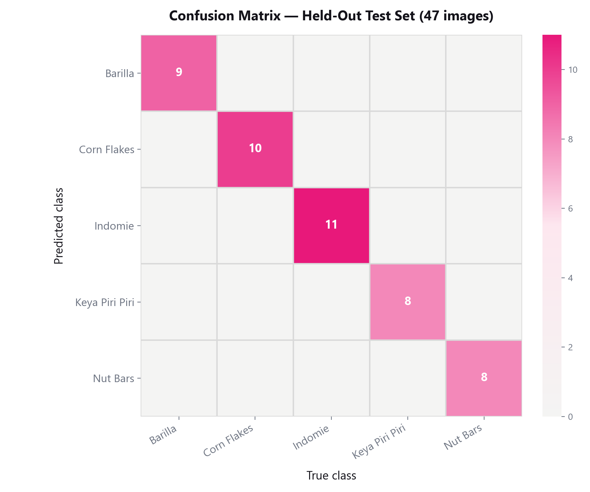
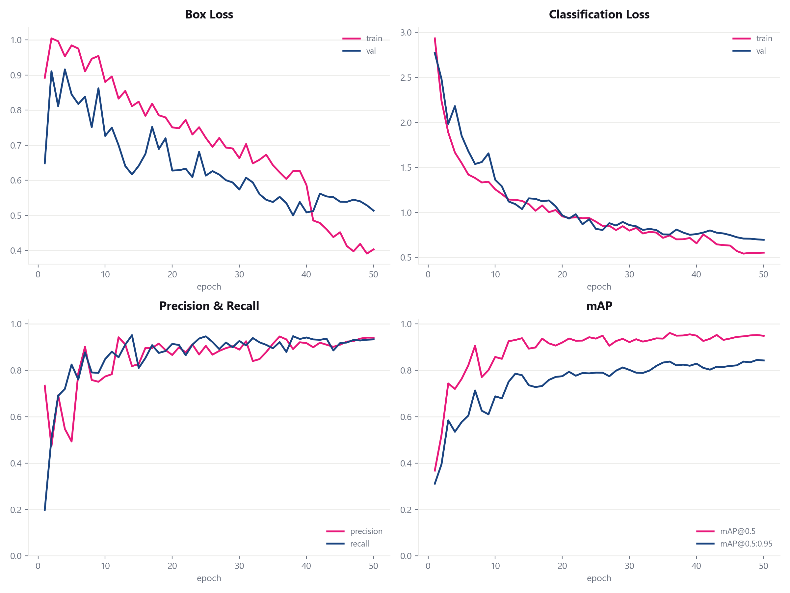
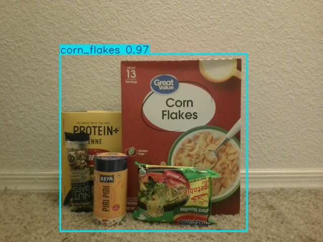
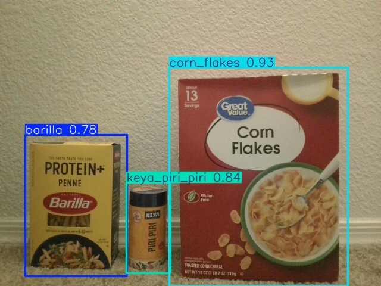

# Inventory Optimization Using Computer Vision

A YOLOv8 object-detection pipeline built for the **Effective Warehousing Using
Computer Vision** final project (ASU CIS 515) — prototyping the core
computer-vision component of an automated inventory-counting system for
ASU's Pitchforks dining hall, which currently spends 6–8 hours a day
manually counting stock.

Full write-up: [analyzewithrutuja.github.io/projects/inventory_optimization_using_open_cv.html](https://analyzewithrutuja.github.io/projects/inventory_optimization_using_open_cv.html)

## What this repo contains

Since Pitchforks' actual warehouse inventory wasn't accessible during the
project timeline, the full pipeline — data collection, annotation, model
training, evaluation, and live deployment testing — was built and validated
end-to-end on a **5-class proxy dataset** (Corn Flakes, Indomie, Barilla,
Keya Piri Piri, Nut Bars): 435 photos, auto-annotated, cleaned to 428, and
used to fine-tune a YOLOv8n detector. The same pipeline transfers directly
to Pitchforks' real inventory by re-running it on photos of the actual stock.

## Pipeline

1. **Data collection** — 435 single-item photos across 5 product classes, varied backgrounds.
2. **Auto-annotation** (`scripts/auto_annotate_*.py`, `grabcut_refine.py`, `review_flagged.py`) —
   bounding boxes generated with **FastSAM** (point-prompted segmentation), refined
   over 8 iterations, manually spot-checked down to 428 clean images.
   Full methodology: [`Annotation_Process_Summary.md`](Annotation_Process_Summary.md).
3. **Class-stratified train/val/test split** (`scripts/make_split.py`) — 70/20/10 per class → 298/83/47 images.
4. **Model training** (`scripts/train_yolo.py`) — YOLOv8n fine-tuned (transfer learning from COCO weights), 50 epochs, CPU.
5. **Synthetic multi-object augmentation** (`scripts/make_synthetic_multi.py`, `make_synthetic_dense.py`,
   `train_yolo_multiobj.py`, `train_yolo_dense.py`) — a documented experiment in using copy-paste
   augmentation (from the existing single-item images/boxes) to teach the model multi-object scenes.
6. **Live demo** (`scripts/webcam_demo.py`) — real-time webcam inference with the fine-tuned weights.

## Results (held-out test set, 47 images)

| Class | Precision | Recall | mAP@0.5 | mAP@0.5:0.95 |
|---|---|---|---|---|
| Barilla | 0.899 | 0.892 | 0.886 | 0.767 |
| Corn Flakes | 0.980 | 1.000 | 0.995 | 0.776 |
| Indomie | 1.000 | 0.912 | 0.995 | 0.886 |
| Keya Piri Piri | 0.961 | 1.000 | 0.995 | 0.974 |
| Nut Bars | 1.000 | 0.986 | 0.995 | 0.737 |
| **Overall** | **0.968** | **0.958** | **0.973** | **0.828** |




## A documented limitation

The model was trained entirely on single-item images, so multi-item scenes
were initially out-of-distribution — closely-clustered products got merged
into one bounding box. Synthetic copy-paste augmentation (generated from the
existing single-item images and their known boxes, no new manual annotation)
fixed this reliably for 2–3 spaced items, but pushing it further to force a
5-item tightly-packed case measurably hurt confidence calibration on real
photos more than it helped — a useful finding about the limits of synthetic
augmentation on a small dataset. Full discussion in the write-up linked above.

| Before mitigation | After mitigation |
|---|---|
|  |  |

## Tech stack

Python · [Ultralytics YOLOv8](https://docs.ultralytics.com/) · [FastSAM](https://github.com/CASIA-IVA-Lab/FastSAM) · OpenCV · PyTorch (CPU)

## Running it

```bash
pip install ultralytics opencv-python
python scripts/make_split.py          # build the train/val/test split
python scripts/train_yolo.py          # fine-tune YOLOv8n
python scripts/webcam_demo.py         # live webcam demo (press SPACE to detect)
```

Note: the raw photo dataset and trained checkpoints are not included in this
repo (see `.gitignore`) due to size — `scripts/make_split.py` and
`scripts/train_yolo.py` regenerate them from a local `CV_photos_resized/`
folder of source images.
